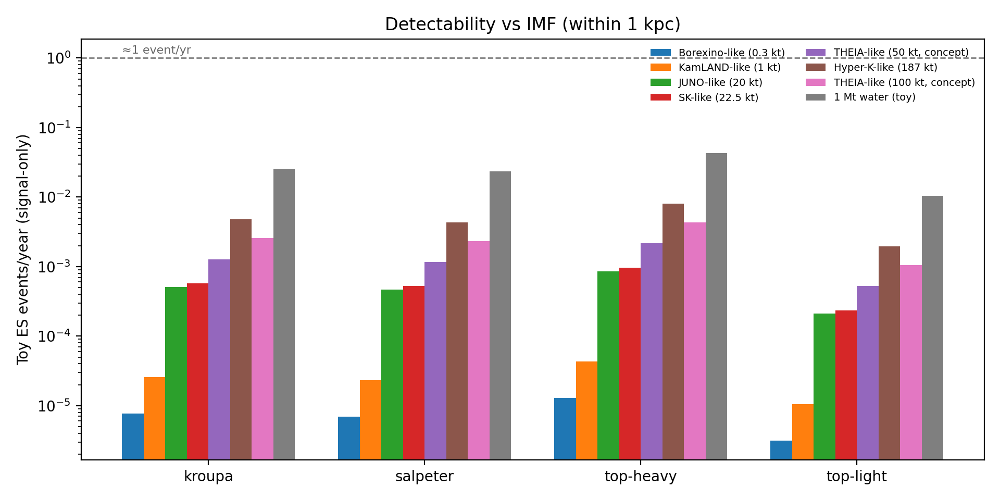
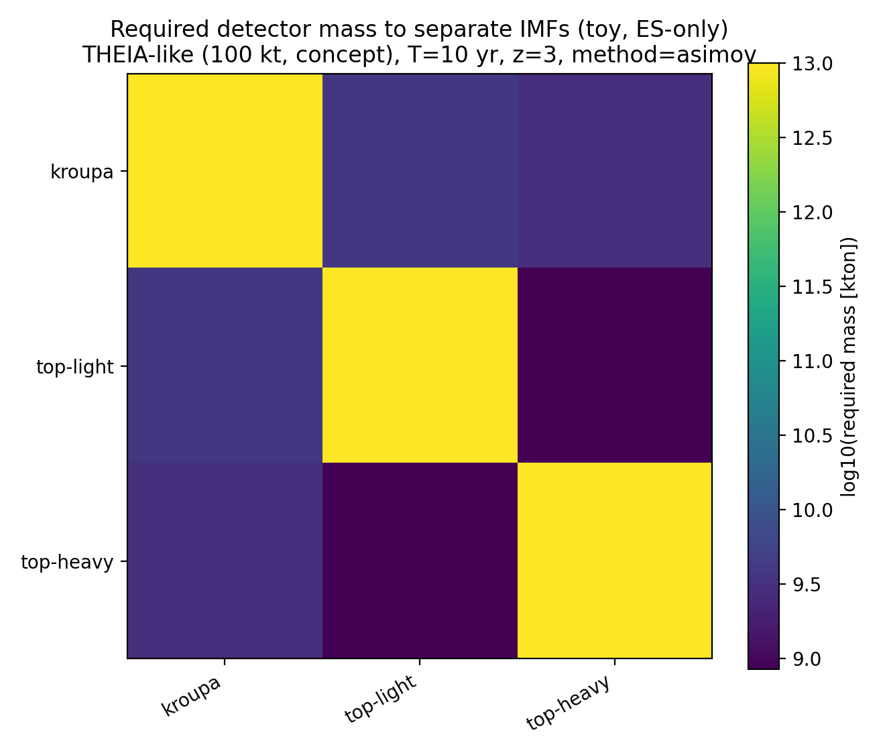

# neutrino_project (toy model): carbon-burning red supergiants + IMF sensitivity

This repository is designed to be **simple and transparent**:
- it estimates the expected number of **carbon-burning red supergiants (C-burning RSGs)** in the Milky Way
- it compares how that number changes with different **IMFs**

It is a **toy population model**, not a full reproduction of `neutrinos.pdf` (Seong et al. 2025), which uses MESA neutrino emissivities and detector simulations.

## The fastest way to run (recommended)

Open `run_pipeline.py`, adjust the **CONFIG** block if you want, then run:

```bash
python3 run_pipeline.py
```

Outputs are written to `outputs/`:
- `outputs/imf_scan.csv`: table of expected counts per IMF (main column: `cburn_rsg_mean`)
- `outputs/imf_scan.png`: bar plot of expected **C-burning RSG** counts per IMF
- `outputs/mw_snapshot_map.png`: 2D toy Milky Way snapshot (phase-colored)
- `outputs/counts_within_radius_vs_time.png`: expected counts vs time (whole MW + within 1 kpc)
- `outputs/toy_neutrino_yield_vs_time.png`: toy flux + toy ES event-rates vs time (SK-like vs future scales)
- `outputs/detectability_imf.csv`: per-IMF toy conversion: counts → flux → ES events/year (within 1 kpc)
- `outputs/detectability_imf_events.png`: bar plot of toy ES events/year vs IMF (several detector masses)
- `outputs/imf_constraint_required_mass.csv`: “if detectable, can it constrain IMF?” toy calculation (required detector mass)
- `outputs/imf_constraint_required_mass.png`: heatmap visualization of the above
- `outputs/phase_timeline_18msun.png`: how phase windows are estimated for one mass
- `outputs/isochrone_hrd_rsg_cut.png`: CMD 3.9 isochrone HR diagram + RSG cut (pedagogical)
- `outputs/track_hrd_18msun.png`: PARSEC track HR diagram with RSG + C-burning highlighted (only if ZIP is present)

If you get `ModuleNotFoundError` (e.g. missing `numpy`), install dependencies:

```bash
pip install -r requirements.txt
```

## Example plots (already generated)

The folder `figures/` contains example outputs for the default `run_pipeline.py` CONFIG,
so you can see what the plots look like without running anything.

### 2D Milky Way snapshot (toy)


### Counts within 1 kpc vs time (toy)


### Toy neutrino flux + events vs time


### Detectability vs IMF (toy)



### “Could this constrain the IMF?” (toy)

This is a *very optimistic* signal-only calculation: it tells you how big a detector would need to be
to separate two IMFs **if** backgrounds could be suppressed well enough.



### Phase-window illustration (one mass)


### Isochrone HR diagram + RSG cut (pedagogical)


### PARSEC track HR diagram (shows C-burning)

This example plot requires the full PARSEC track ZIP to generate, but we include
an example image here so you can see what it looks like:


## What “C-burning RSG” means in this project

We define:

- **RSG (toy definition)**: `Teff <= 4000 K` and `log10(L/Lsun) >= 4.5`
- **C-burning (toy definition)**: PARSEC track column `LC >= 1e-3`
- **C-burning RSG**: overlap of the above two conditions

These definitions are intentionally simple and are meant for sensitivity studies.

## How “events/year” is computed (toy)

This project computes a **signal-only** (background-free) elastic-scattering estimate:

1) From SFR + IMF + phase durations, estimate the expected number of C-burning RSGs:
   - in the whole Milky Way: `N_CburnRSG(MW)`
   - within a sphere around the Sun: `N_CburnRSG(<R)`
2) Convert to a local number flux at Earth assuming each star has the same neutrino luminosity `Lν`:

   `Φ_total ≈ N_CburnRSG(<R) × (Lν/<E>) × (1/(4π)) × <1/d² | d≤R>`

3) Convert flux to a toy ES rate:

   `events/year = N_e × ∫ dE [ Φ_total f(E) ] σ_ES(E)`

Important: **backgrounds, thresholds, efficiencies are not included**, so these event rates should only be used for scaling comparisons (e.g. between IMFs or detector masses).

The detector list is intentionally “hopeful”: it includes concepts like THEIA-like WbLS detector masses. In this toy ES-only model, larger fiducial mass always increases signal linearly, but real detectability is usually background-limited at sub-MeV energies.

## Data files

The repo includes small precomputed phase-window tables:
- `data/parsec/v2_vms/phases_Z0p014.csv`
- `data/parsec/v2_vms/phases_Z0p017.csv`

These contain (per mass):
- lifetime
- C-burning window duration
- RSG duration
- overlap duration (C-burning AND RSG)

### What to change in `run_pipeline.py`

Common “knobs” in the CONFIG block:
- `phases_csv`: switch between `phases_Z0p014.csv` and `phases_Z0p017.csv`
- `imfs`: choose which IMFs to compare
- `sfr_msun_per_yr`, `duration_myr`: star formation assumptions
- `n_sims`: Monte Carlo precision (bigger = smoother, slower)
- `make_*`: turn individual plots on/off

The **large PARSEC track ZIPs** are **not** included (they are ~85–95 MB each). If you obtain them yourself, you can set:
`recompute_phases_from_zip=True` in `run_pipeline.py` to regenerate the phase CSV.

This repo also includes small CMD 3.9 isochrone tables (for plotting):
- `data/parsec/isochrones/parsec_cmd39_v1p2s_Z0p0152_logAge7p0.dat`
- `data/parsec/isochrones/parsec_cmd39_v2p0_Z0p0152_logAge7p0.dat`

## Optional: advanced CLI (uses flags)

If you later want a more flexible interface:

```bash
python3 -m neutrino_project --help
```

Useful commands:
- `extract-phases`: build a phases CSV from a PARSEC track ZIP
- `imf-scan`: compare IMFs and get the expected C-burning RSG counts
- `plot-hr`: plot an HR diagram from one track and highlight RSG/C-burning regions

## How this relates to neutrinos.pdf (Seong et al. 2025)

This project focuses on **population counts** (how many C-burning RSGs exist, and how that depends on the IMF).

To move toward reproducing the paper’s detectability calculations:
- keep the population backbone here
- replace the toy neutrino part with a calibrated `L_ν(t, M, Z)` and spectra from MESA (or the paper’s tables/figures)

Implementation notes are in `neutrino_project/neutrinos.py`.
